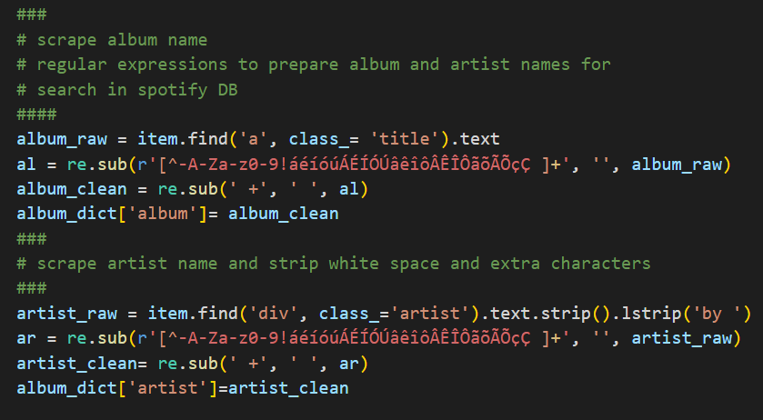
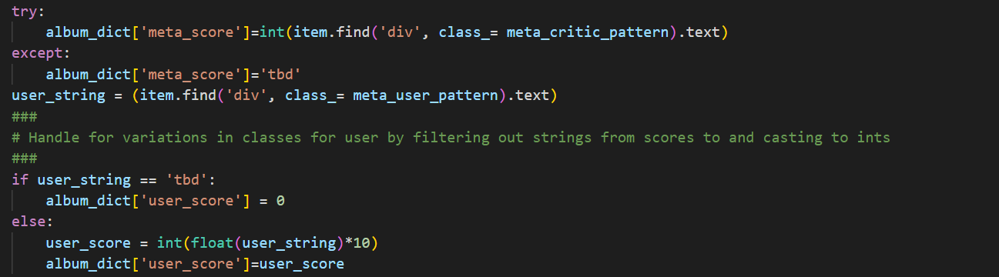
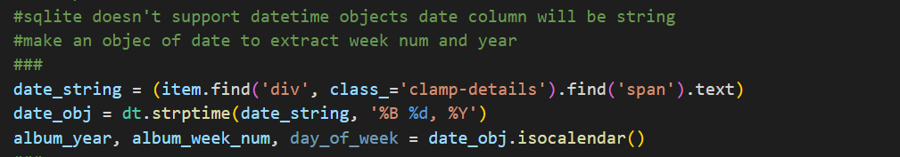
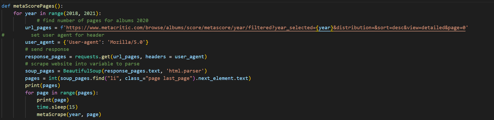
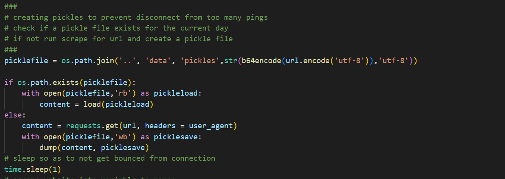
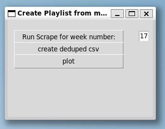
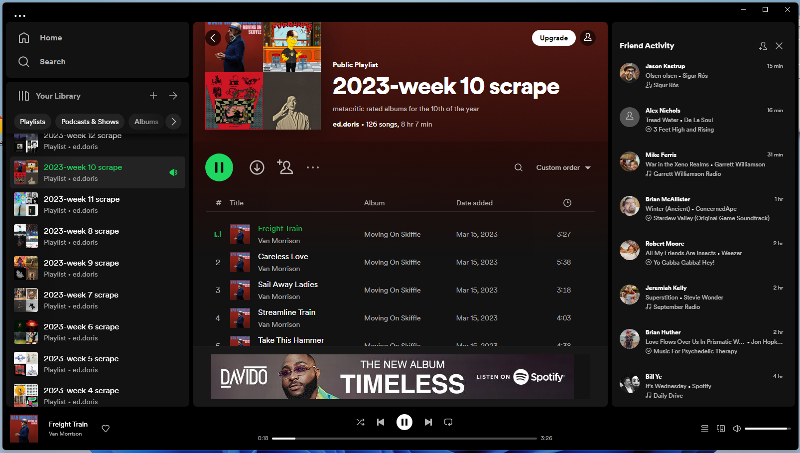

# Meta_GUI
---
A graphical interface that coordinates an app to collect new music each week from metacritic, stores metadata on these albums,  generates dynamically labelled csv files and an app that populates a playlist in my spotify account by using the Spotify API.
## Overview
---
I enjoyed working on this project as an exercise in broadening my foundation in python and app developement overall. I look forward to aquiring new skills and understanding as I continue its developement.

## Background
---
As a music enthusiast, I am always exploring new music. 

While many streaming services have playlists and access to new releases, I grew tired of feeling bound to algorithms and wanted to automate curating playlists on my own. 

What I really wanted was a raw dump of albums into a list that I could listen to and select from regardless of my listening history or derived preferences. 

That led to these applications. Which also grew as I decided to flesh out my understanding of python, working with documentation and software development overall. 

Metacritic scrapping apps:
- An [app](https://github.com/dorisep/meta_gui/blob/main/apps/scrape.py) to track albums released each week.

- An [app](https://github.com/dorisep/meta_gui/blob/main/apps/historical_scrape.py) that collects the archived releases from all previous years.

Spotify playlist generation app:
- An [interface](https://github.com/dorisep/meta_gui/blob/main/apps/playlist_app.py) for the Spoitfy api that creates and populates a playlist on an account.

Tkinter app:
- A [grahical user interface](https://github.com/dorisep/meta_gui/blob/main/apps/meta_GUI.py) that tracks the current week and runs the scaping function and playlist generation.

## Sources
---
The following are resources I used in this project:

Spotify [API](https://developer.spotify.com/documentation/web-api/) documentation. All neccesary credentials can be found here.

CodingEntrepreneurs [tutorial](https://www.youtube.com/watch?v=xdq6Gz33khQ&list=PLEsfXFp6DpzQjDBvhNy5YbaBx9j-ZsUe6&index=19).

---

## Code examples
### For the extraction of data I used Beautiful Soup to parse the html and collect data.
### I used Regular expression along with string methods to transform the data during extraction.

---

### There were issues with encoding and the spotify api. I also needed to handle instances where the term 'TBD' or a float was used in place of an integer for album scores on Metacritics site.

---

### The number of week from each of the dates of album releases in order to facilitate identifying new albums and for storage in sqlite.

---

### When scraping historical review aggragations the script needed to be dynamic and account for the variation in the number of pages available to scrape for any given year of album releases.

---

### During development in order to prevent unecessary requests to the Metacritic servers serialization was introduced.

---

### The GUI made with tkinter for running the web scrapping app and playlist creation on spotify using the number of the week for the year

---

### The final result showing playlist dynamically named

